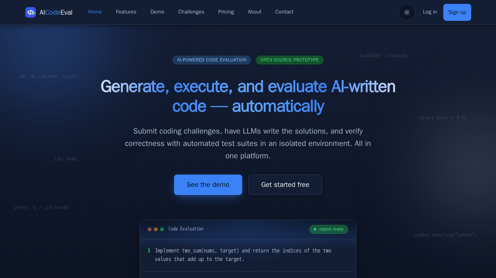
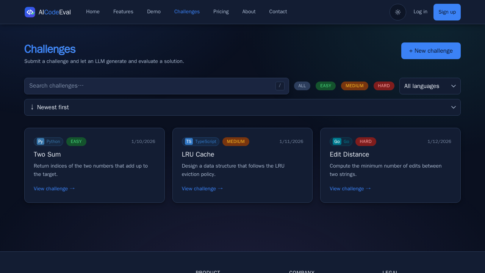

# AI Code Evaluation Platform

[](https://www.typescriptlang.org/)
[](https://react.dev/)
[](https://www.python.org/)
[](https://fastapi.tiangolo.com/)
[](https://www.postgresql.org/)
[](https://redis.io/)
[](https://www.docker.com/)
[](#running-the-tests-locally)
[](LICENSE)
<p align="center">
  
</p>

<p align="center">
  
</p>


A platform that accepts coding challenges, generates solutions with LLMs, executes the
generated code in isolated Docker sandboxes, runs automated test suites, and produces
objective evaluation results — scores, logs, and metrics instead of a vibe.

---

## Contents

- [Purpose](#purpose)
- [Screenshots](#screenshots)
- [How it works](#how-it-works)
- [Supported languages](#supported-languages)
- [Architecture](#architecture)
- [Tech stack](#tech-stack)
- [Getting started](#getting-started)
- [Running the tests locally](#running-the-tests-locally)
- [Repository layout](#repository-layout)
- [Design notes](#design-notes)
- [AI disclosure](#ai-disclosure)
- [License](#license)
- [Credits](#credits)

---

## Purpose

Assistants write code faster than reviewers can check it. When a model produces 200 lines
across five files, "does it actually work?" stops being answerable by eye, and the usual
substitutes — does it compile, does it look idiomatic, did the author skim it — catch
none of the interesting failures. The interesting failures are behavioural: the off-by-one
on the empty input, the missing null guard, the test that passes because it asserts the
wrong thing.

This platform answers that question mechanically. A challenge carries a prompt and a real
test suite. A chosen LLM generates a solution. The solution is executed against those
tests inside a sandbox that has no network and hard CPU, memory, and wall-clock caps. What
comes back is the pass/fail split, the runner's own output, and the timings — the same
evidence for every provider, which is the point. Comparing two models only means something
when the yardstick did not move between them.

Because the harness is uniform, results are comparable across prompts, across languages,
and across runs. The output is a measurement, not an impression.

## Screenshots

### Landing page

The public entry point — what the product claims, and the path into signing up.


### Challenge list and search

Browse the challenge catalogue, filter by language, and open a challenge to see its
prompt, tests, and submission history.



### Evaluation result

The payoff screen: the score ring, the pass/fail split, the runner's raw output, and the
timings for a single submission.

<!--  -->

### Admin dashboard

User, challenge, and submission management, behind `require_admin` on the backend and
`AdminRoute` on the frontend.

<!--  -->

## How it works

1. **Define a challenge** — a prompt, a language, and a real test suite that decides
   whether a solution is correct.
2. **Generate** — the worker calls the selected provider (OpenAI, Anthropic, Gemini, Groq,
   or a local Ollama model) to produce a candidate solution.
3. **Sandbox** — the solution and its tests are mounted into a throwaway container with no
   network access, capped CPU/RAM, and a 30-second wall clock.
4. **Run the tests** — the language's own runner executes them: `pytest`, `node --test`,
   `tsx --test`, the JUnit Platform console, or `go test -v`.
5. **Score and record** — pass/fail counts, runner output, and timings are written to the
   result, and the submission's status moves to `passed` or `failed`.

Generation and execution are deliberately decoupled: the API call returns immediately with
a queued submission, and a Celery worker owns the slow half. If Docker is unavailable the
sandbox falls back to a subprocess so local development still works — with the isolation
guarantee honestly weaker, rather than silently absent.

## Supported languages

| Language   | Test runner              | Entry file      | Isolation |
|------------|--------------------------|-----------------|-----------|
| Python     | `pytest`                 | `solution.py`   | Container |
| JavaScript | `node --test`            | `solution.js`   | Container |
| TypeScript | `tsx --test`             | `solution.ts`   | Container |
| Java       | `javac` + JUnit Platform | `Solution.java` | Container |
| Go         | `go test -v`             | `solution.go`   | Container |

Every runtime is baked into `backend/Dockerfile.sandbox`. `GOPROXY` is disabled and the Go
module cache is redirected to tmpfs, so the container cannot reach the network even if the
image's own egress policy changes.

## Architecture

```text
User → Frontend (React 19)
  ↓
FastAPI Backend
  ↓
PostgreSQL (users, challenges, submissions, results)
  ↓
Redis Queue (Celery tasks)
  ↓
Background Worker
  ↓
LLM API (OpenAI / Anthropic / Gemini / Groq / Ollama)
  ↓
Generated Code
  ↓
Docker Sandbox (isolated, resource-capped)
  ↓
Test runner
  ↓
Evaluation Result (score, logs, metrics)
```

## Tech stack

**Frontend** — React 19, TypeScript, Vite 8, Oxlint, Vitest, Playwright, React Router.

**Backend** — Python 3.14, FastAPI, SQLAlchemy, Alembic, Pydantic, Celery, pytest, Ruff.

**Infrastructure** — PostgreSQL, Redis, Docker, Docker Compose. Kubernetes manifests
(Kind + Kustomize, with Helm and DevSpace) are included as an optional path; Compose is
the primary local workflow.

## Getting started

### Prerequisites

- Docker with Compose
- Node.js 22 and Python 3.14 with `uv` (only for the host-native loop)
- At least one provider API key — or use Ollama and the free demo model

### The dev sandbox

```bash
make dev-up      # build the image, run uvicorn + vite + celery
make dev-log     # tail both services
make dev-down    # stop
```

| Service     | URL                     |
|-------------|-------------------------|
| Frontend    | http://localhost:5173   |
| Backend API | http://localhost:8000   |
| API docs    | http://localhost:8000/docs |

### Host-native loop

Faster once dependencies are warm:

```bash
make infra-up                          # postgres + redis + sandbox image only
cd backend && uv sync && uv run uvicorn app.main:app --reload
cd frontend && npm install && npm run dev
```

### Configuration

Two `.env` files, read by two different readers — putting a variable in the wrong one fails
silently, which trips up nearly everyone once:

- **`<repo-root>/.env`** — read by Docker Compose on the host. Provider keys
  (`GROQ_API_KEY`, `GEMINI_API_KEY`, …), `LLM_FALLBACK_*`, `OLLAMA_BASE_URL`.
- **`backend/.env`** — read by pydantic `Settings`. `DATABASE_URL`, `REDIS_URL`,
  `JWT_SECRET_KEY`, `DOCKER_*`.

`backend/.env.example` is the safe reference for both. Never commit either file.

## Running the tests locally

The full gate:

```bash
make check
```

Or each piece on its own:

```bash
# Backend — 887 tests
cd backend && uv run pytest

# Frontend — 1119 tests
cd frontend && npx vitest run

# Lint
cd backend  && uv run ruff check src/ tests/
cd frontend && npm run lint

# Type check and production build
cd frontend && npm run build

# Browser tests — need a real rendered browser, so not part of `make check`
make test-e2e
```

Chromium is baked into the dev image, so `make test-e2e` also works inside the sandbox.

Several suites assert on CSS and on copy rather than on rendered pixels, because most of
what regressed here was invisible in a diff: gradient titles quietly dropping below AA
contrast, an ambient animation forgetting to respect `prefers-reduced-motion`, a shell that
lost its `isolation: isolate` and dropped behind the page background. Those are cheap to
check in Vitest and expensive to notice by eye.

## Repository layout

```text
backend/          FastAPI app, Celery workers, evaluation logic
frontend/         React 19 + TypeScript + Vite
k8s/              Kind config, Kustomize base/overlays, Helm chart
scripts/          Toolchain setup, sandbox shell, K8s helpers
docs/             UX audits, visual sweeps, verification reports
Makefile          The daily loop: dev sandbox, checks, e2e
AGENTS.md         Conventions and workflow rules for agents
DEVELOPMENT.md    Day-to-day cheatsheet
```

## Design notes

A few decisions that are load-bearing and non-obvious:

- **Uniform harness.** The same sandbox and runner contract for every language, so a score
  means the same thing regardless of which one produced it.
- **Fail closed on isolation.** The subprocess fallback exists for developer ergonomics and
  is documented as weaker, rather than being passed off as equivalent.
- **Contrast and motion are tested, not eyeballed.** Token-level WCAG checks and
  reduced-motion assertions are unit tests, because both regress silently.
- **Contrast as a first-class token.** `--color-primary-strong` and friends exist because
  the identity colours are tuned for fills and borders, not for 12px text on a tint.

## AI disclosure

This project was developed with the assistance of AI coding tools, used for code
generation, refactoring, test scaffolding, and documentation. Generated output was
reviewed, tested, and adapted to the project's architecture and conventions.

The design decisions, architecture, and integration choices are the author's. Where a
generated suggestion conflicted with an existing pattern, the pattern won — several
deliberate rejections are recorded in comments next to the code they prevented.

## License

**Portfolio License** — see [LICENSE](LICENSE).

You may view, study, and learn from this code, and use it as inspiration for your own work.
Commercial use, redistribution, and production deployment require permission from the
author. Third-party dependencies remain under their own licenses and are not covered by
this one.

## Credits

Built and designed by **Felipe Inoue** as a portfolio project on full-stack development,
secure code execution, and automated evaluation.

Standing on the shoulders of the open-source communities behind React, FastAPI, Docker,
Celery, and the provider SDKs.